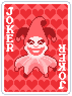
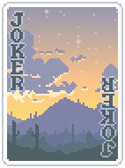
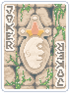
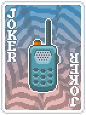
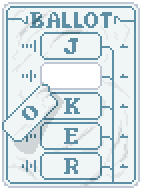
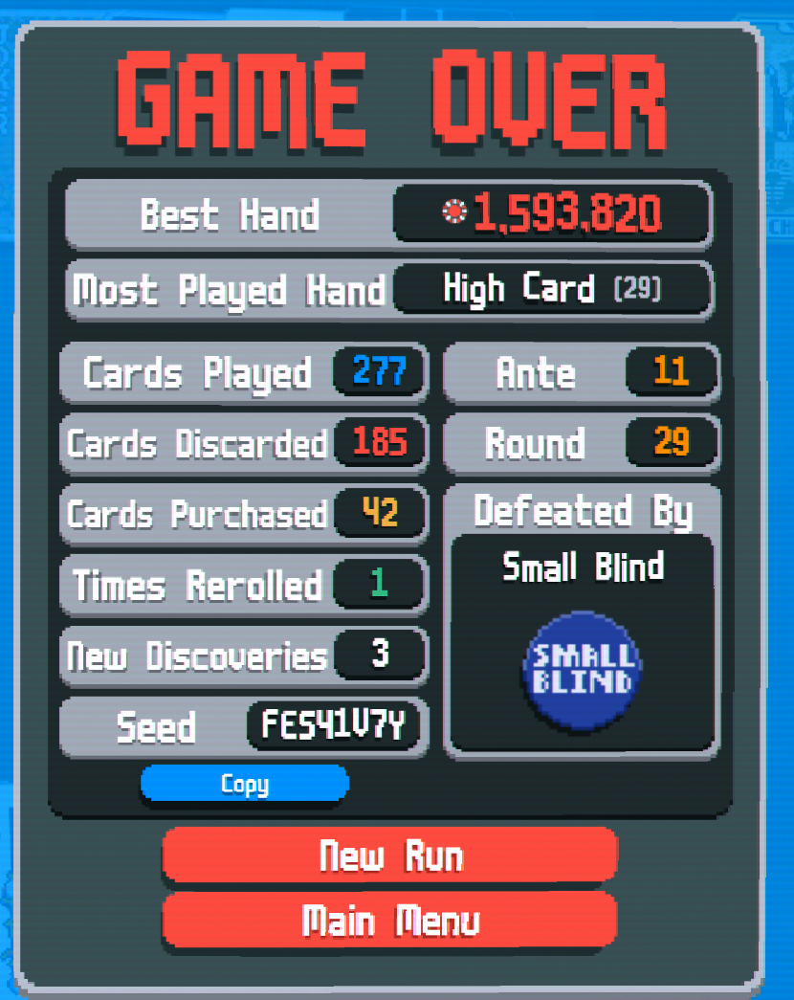

# Balatro

[TOC]

## Jokers

As of update `1.0.1n-FULL`, there are 150 total jokers of varying rarities, with 105 unlocked from the start and 45 unlockable through specific conditions. 

| #    | Image     | Name  | Effect    | Cost  | Rarity    | Unlock Requirement     |
|-----------|-----------|-------|-----------|-------|-----------|-----------------------|
| 1 |  | Joker | +4 Mult | $2 | common | Available from start. |
| 2 |  | Greedy Joker | Played cards with  Diamond suit give +3 Mult when scored | $5 | common | Available from start. |
| 3 |  | Lusty Joker | Played cards with  Heart suit give +3 Mult when scored | $5 | common | Available from start. |
| 4 |  | Wrathful Joker | Played cards with  Spade suit give +3 Mult when scored | $5 | common | Available from start. |
| 5 |  | Gluttonous Joker | Played cards with  Club suit give +3 Mult when scored | $5 | common | Available from start. |
| 6 |  | Jolly Joker | +8 Mult if played hand contains a Pair | $3 | common | Available from start. |
| 7 |  | Zany Joker | +12 Mult if played hand contains a Three of a Kind | $4 | common | Available from start. |
| 8 |  | Mad Joker | +10 Mult if played hand contains a Two Pair | $4 | common | Available from start. |
| 9 |  | Crazy Joker | +12 Mult if played hand contains a Straight | $4 | common | Available from start. |
| 10 |  | Droll Joker | +10 Mult if played hand contains a Flush | $4 | common | Available from start. |
| 11 |  | Sly Joker | +50 Chips if played hand contains a Pair | $3 | common | Available from start. |
| 12 |  | Wily Joker | +100 Chips if played hand contains a Three of a Kind | $4 | common | Available from start. |
| 13 |  | Clever Joker | +80 Chips if played hand contains a Two Pair | $4 | common | Available from start. |
| 14 |  | Devious Joker | +100 Chips if played hand contains a Straight | $4 | common | Available from start. |
| 15 |  | Crafty Joker | +80 Chips if played hand contains a Flush | $4 | common | Available from start. |
| 16 |  | Half Joker | +20 Mult if played hand contains 3 or fewer cards. | $5 | common | Available from start. |
| 17 |  | Joker Stencil | X1 Mult for each empty Joker slot. Joker Stencil included(Currently X1 Mult) | $8 | uncommon | Available from start. |
| 18 |  | Four Fingers | All Flushes and Straights can be made with 4 cards | $7 | uncommon | Available from start. |
| 19 |  | Mime | Retrigger all card held in hand abilities | $5 | uncommon | Available from start. |
| 20 |  | Credit Card | Go up to -$20 in debt | $1 | common | Available from start. |
| 21 |  | Ceremonial Dagger | When Blind is selected, destroy Joker to the right and permanently add double its sell value to this Mult (Currently +0 Mult) | $6 | uncommon | Available from start. |
| 22 |  | Banner | +30 Chips for each remaining discard | $5 | common | Available from start. |
| 23 |  | Mystic Summit | +15 Mult when 0 discards remaining | $5 | common | Available from start. |
| 24 |  | Marble Joker | Adds one Stone card to the deck when Blind is selected | $6 | uncommon | Available from start. |
| 25 |  | Loyalty Card | X4 Mult every 6 hands played5 remaining | $5 | uncommon | Available from start. |
| 26 |  | 8 Ball | 1 in 4 chance for each played 8 to create a Tarot card when scored(Must have room) | $5 | common | Available from start. |
| 27 |  | Misprint | +0-23 Mult | $4 | common | Available from start. |
| 28 |  | Dusk | Retrigger all played cards in final hand of the round | $5 | uncommon | Available from start. |
| 29 |  | Raised Fist | Adds double the rank of lowest ranked card held in hand to Mult | $5 | common | Available from start. |
| 30 |  | Chaos the Clown | 1 free Reroll per shop | $4 | common | Available from start. |
| 31 |  | Fibonacci | Each played Ace, 2, 3, 5, or 8 gives +8 Mult when scored | $8 | uncommon | Available from start. |
| 32 |  | Steel Joker | Gives X0.2 Mult for each Steel Card in your full deck(Currently X1 Mult) | $7 | uncommon | Available from start. (Can only appear in the shop when there is a Steel Card in the deck.) |
| 33 |  | Scary Face | Played face cards give +30 Chips when scored | $4 | common | Available from start. |
| 34 |  | Abstract Joker | +3 Mult for each Joker card(Currently +0 Mult) | $4 | common | Available from start. |
| 35 |  | Delayed Gratification | Earn $2 per discard if no discards are used by end of the round | $4 | common | Available from start. |
| 36 |  | Hack | Retrigger each played 2, 3, 4, or 5 | $6 | uncommon | Available from start. |
| 37 |  | Pareidolia | All cards are considered face cards | $5 | uncommon | Available from start. |
| 38 |  | Gros Michel | +15 Mult1 in 6 chance this is destroyed at the end of round. | $5 | common | Available from start. |
| 39 |  | Even Steven | Played cards with even rank give +4 Mult when scored(10, 8, 6, 4, 2) | $4 | common | Available from start. |
| 40 |  | Odd Todd | Played cards with odd rank give +31 Chips when scored(A, 9, 7, 5, 3) | $4 | common | Available from start. |
| 41 |  | Scholar | Played Aces give +20 Chips and +4 Mult when scored | $4 | common | Available from start. |
| 42 |  | Business Card | Played face cards have a 1 in 2 chance to give $2 when scored | $4 | common | Available from start. |
| 43 |  | Supernova | Adds the number of times poker hand has been played this run to Mult | $5 | common | Available from start. |
| 44 |  | Ride the Bus | This Joker gains +1 Mult per consecutive hand played without a scoring face card(Currently +0 Mult) | $6 | common | Available from start. |
| 45 |  | Space Joker | 1 in 4 chance to upgrade level of played poker hand | $5 | uncommon | Available from start. |
| 46 |  | Egg | Gains $3 of sell value at end of round | $4 | common | Available from start. |
| 47 |  | Burglar | When Blind is selected, gain +3 Hands and lose all discards | $6 | uncommon | Available from start. |
| 48 |  | Blackboard | X3 Mult if all cards held in hand are  Spades or  Clubs | $6 | uncommon | Available from start. |
| 49 |  | Runner | Gains +15 Chips if played hand contains a Straight(Currently +0 Chips) | $5 | common | Available from start. |
| 50 |  | Ice Cream | +100 Chips-5 Chips for every hand played | $5 | common | Available from start. |
| 51 |  | DNA | If first hand of round has only 1 card, add a permanent copy to deck and draw it to hand | $8 | rare | Available from start. |
| 52 |  | Splash | Every played card counts in scoring | $3 | common | Available from start. |
| 53 |  | Blue Joker | +2 Chips for each remaining card in deck(Currently +104 Chips) | $5 | common | Available from start. |
| 54 |  | Sixth Sense | If first hand of round is a single 6, destroy it and create a Spectral card(Must have room) | $6 | uncommon | Available from start. |
| 55 |  | Constellation | This Joker gains X0.1 Mult every time a Planet card is used(Currently X1 Mult) | $6 | uncommon | Available from start. |
| 56 |  | Hiker | Every played card permanently gains +5 Chips when scored | $5 | uncommon | Available from start. |
| 57 |  | Faceless Joker | Earn $5 if 3 or more face cards are discarded at the same time | $4 | common | Available from start. |
| 58 |  | Green Joker | +1 Mult per hand played-1 Mult per discard(Currently +0 Mult) | $4 | common | Available from start. |
| 59 |  | Superposition | Create a Tarot card if poker hand contains an Ace and a Straight(Must have room) | $4 | common | Available from start. |
| 60 |  | To Do List | Earn $4 if poker hand is a [Poker Hand], poker hand changes at end of round | $4 | common | Available from start. |
| 61 |  | Cavendish | X3 Mult1 in 1000 chance this card is destroyed at the end of round | $4 | common | Available from start. (Can only appear in the shop when  Gros Michel has destroyed itself in the current run.) |
| 62 |  | Card Sharp | X3 Mult if played poker hand has already been played this round | $6 | uncommon | Available from start. |
| 63 |  | Red Card | This Joker gains +3 Mult when any Booster Pack is skipped(Currently +0 Mult) | $5 | common | Available from start. |
| 64 |  | Madness | When Small Blind or Big Blind is selected, gain X0.5 Mult and destroy a random Joker(Currently X1 Mult) | $7 | uncommon | Available from start. |
| 65 |  | Square Joker | This Joker gains +4 Chips if played hand has exactly 4 cards(Currently 0 Chips) | $4 | common | Available from start. |
| 66 |  | Séance | If poker hand is a Straight Flush, create a random Spectral card(Must have room) | $6 | uncommon | Available from start. |
| 67 |  | Riff-Raff | When Blind is selected, create 2 Common Jokers(Must have room) | $6 | common | Available from start. |
| 68 |  | Vampire | This Joker gains X0.1 Mult per scoring Enhanced card played, removes card Enhancement(Currently X1 Mult) | $7 | uncommon | Available from start. |
| 69 |  | Shortcut | Allows Straights to be made with gaps of 1 rank(ex: 10 8 6 5 3) | $7 | uncommon | Available from start. |
| 70 |  | Hologram | This Joker gains X0.25 Mult every time a playing card is added to your deck(Currently X1 Mult) | $7 | uncommon | Available from start. |
| 71 |  | Vagabond | Create a Tarot card if hand is played with $4 or less | $8 | rare | Available from start. |
| 72 |  | Baron | Each King held in hand gives X1.5 Mult | $8 | rare | Available from start. |
| 73 |  | Cloud 9 | Earn $1 for each 9 in your full deck at end of round(Currently $4) | $7 | uncommon | Available from start. |
| 74 |  | Rocket | Earn $1 at end of round. Payout increases by $2 when Boss Blind is defeated | $6 | uncommon | Available from start. |
| 75 |  | Obelisk | This Joker gains X0.2 Mult per consecutive hand played without playing your most played poker hand(Currently X1 Mult) | $8 | rare | Available from start. |
| 76 |  | Midas Mask | All played face cards become Gold cards when scored | $7 | uncommon | Available from start. |
| 77 |  | Luchador | Sell this card to disable the current Boss Blind | $5 | uncommon | Available from start. |
| 78 |  | Photograph | First played face card gives X2 Mult when scored | $5 | common | Available from start. |
| 79 |  | Gift Card | Add $1 of sell value to every Joker and Consumable card at end of round | $6 | uncommon | Available from start. |
| 80 |  | Turtle Bean | +5 hand size, reduces by 1 each round | $6 | uncommon | Available from start. |
| 81 |  | Erosion | +4 Mult for each card below [the deck's starting size] in your full deck(Currently +0 Mult) | $6 | uncommon | Available from start. |
| 82 |  | Reserved Parking | Each face card held in hand has a 1 in 2 chance to give $1 | $6 | common | Available from start. |
| 83 |  | Mail-In Rebate | Earn $5 for each discarded [rank], rank changes every round | $4 | common | Available from start. |
| 84 |  | To the Moon | Earn an extra $1 of interest for every $5 you have at end of round | $5 | uncommon | Available from start. |
| 85 |  | Hallucination | 1 in 2 chance to create a Tarot card when any Booster Pack is opened(Must have room) | $4 | common | Available from start. |
| 86 |  | Fortune Teller | +1 Mult per Tarot card used this run(Currently +0) | $6 | common | Available from start. |
| 87 |  | Juggler | +1 hand size | $4 | common | Available from start. |
| 88 |  | Drunkard | +1 discard each round | $4 | common | Available from start. |
| 89 |  | Stone Joker | Gives +25 Chips for each Stone Card in your full deck(Currently +0 Chips) | $6 | uncommon | Available from start. (Can only appear in the shop when there is a Stone Card in the deck.) |
| 90 |  | Golden Joker | Earn $4 at end of round | $6 | common | Available from start. |
| 91 |  | Lucky Cat | This Joker gains X0.25 Mult every time a Lucky card successfully triggers(Currently X1 Mult) | $6 | uncommon | Available from start. (Can only appear in the shop when there is a Lucky Card in the deck.) |
| 92 |  | Baseball Card | Uncommon Jokers each give X1.5 Mult | $8 | rare | Available from start. |
| 93 |  | Bull | +2 Chips for each $1 you have(Currently +0 Chips) | $6 | uncommon | Available from start. |
| 94 |  | Diet Cola | Sell this card to create a free Double Tag | $6 | uncommon | Available from start. |
| 95 |  | Trading Card | If first discard of round has only 1 card, destroy it and earn $3 | $6 | uncommon | Available from start. |
| 96 |  | Flash Card | This Joker gains +2 Mult per reroll in the shop(Currently +0 Mult) | $5 | uncommon | Available from start. |
| 97 |  | Popcorn | +20 Mult-4 Mult per round played | $5 | common | Available from start. |
| 98 |  | Spare Trousers | This Joker gains +2 Mult if played hand contains a Two Pair(Currently +0 Mult) | $6 | uncommon | Available from start. |
| 99 |  | Ancient Joker | Each played card with [suit] gives X1.5 Mult when scored,suit changes at end of round | $8 | rare | Available from start. |
| 100 |  | Ramen | X2 Mult, loses X0.01 Mult per card discarded | $6 | uncommon | Available from start. |
| 101 |  | Walkie Talkie | Each played 10 or 4 gives +10 Chips and +4 Mult when scored | $4 | common | Available from start. |
| 102 |  | Seltzer | Retrigger all cards played for the next 10 hands | $6 | uncommon | Available from start. |
| 103 |  | Castle | This Joker gains +3 Chips per discarded [suit] card, suit changes every round(Currently +0 Chips) | $6 | uncommon | Available from start. |
| 104 |  | Smiley Face | Played face cards give +5 Mult when scored | $4 | common | Available from start. |
| 105 |  | Campfire | This Joker gains X0.25 Mult for each card sold, resets when Boss Blind is defeated(Currently X1 Mult) | $9 | rare | Available from start. |
| 106 |  | Golden Ticket | Played Gold cards earn $4 when scored | $5 | common | Play a 5 card hand that contains only Gold cards. (Can only appear in the shop when there is a Gold Card in the deck.) |
| 107 |  | Mr. Bones | Prevents Death if chips scored are at least 25% of required chipsself destructs | $5 | uncommon | Lose five runs. |
| 108 |  | Acrobat | X3 Mult on final hand of round | $6 | uncommon | Play 200 hands |
| 109 |  | Sock and Buskin | Retrigger all played face cards | $6 | uncommon | Play 300 face cards across all runs. |
| 110 |  | Swashbuckler | Adds the sell value of all other owned Jokers to Mult(Currently +1 Mult) | $4 | common | Sell 20 Jokers. |
| 111 |  | Troubadour | +2 hand size,-1 hand per round | $6 | uncommon | Win 5 consecutive rounds by playing only a single hand in each. (Discards are fine.) |
| 112 |  | Certificate | When round begins, add a random playing card with a random seal to your hand | $6 | uncommon | Have a Gold card with a Gold Seal. |
| 113 |  | Smeared Joker |  Hearts and  Diamonds count as the same suit,  Spades and  Clubs count as the same suit | $7 | uncommon | Have 3 or more Wild Cards in your deck. |
| 114 |  | Throwback | X0.25 Mult for each Blind skipped this run(Currently X1 Mult) | $6 | uncommon | Continue a run from the Main Menu. |
| 115 |  | Hanging Chad | Retrigger first played card used in scoring 2 additional times | $4 | common | Beat a Boss Blind with a High Card hand. |
| 116 |  | Rough Gem | Played cards with  Diamond suit earn $1 when scored | $7 | uncommon | Have at least 30 Diamonds in your deck |
| 117 |  | Bloodstone | 1 in 2 chance for played cards with  Heart suit to give X1.5 Mult when scored | $7 | uncommon | Have at least 30 Hearts in your deck. |
| 118 |  | Arrowhead | Played cards with  Spade suit give +50 Chips when scored | $7 | uncommon | Have at least 30 Spades in your deck. |
| 119 |  | Onyx Agate | Played cards with  Club suit give +7 Mult when scored | $7 | uncommon | Have at least 30 Clubs in your deck |
| 120 |  | Glass Joker | This Joker gains X0.75 Mult for every Glass Card that is destroyed(Currently X1 Mult) | $6 | uncommon | Have 5 or more Glass cards in your deck. (Can only appear in the shop when there is a Glass Card in the deck.) |
| 121 |  | Showman | Joker, Tarot, Planet, and Spectral cards may appear multiple times | $5 | uncommon | Reach Ante level 4 |
| 122 |  | Flower Pot | X3 Mult if poker hand contains a  Diamond card,  Club card,  Heart card, and  Spade card | $6 | uncommon | Reach Ante Level 8 |
| 123 |  | Blueprint | Copies ability of Joker to the right | $10 | rare | Win 1 run. |
| 124 |  | Wee Joker | This Joker gains +8 Chips when each played 2 is scored(Currently +0  Chips) | $8 | rare | Win a run in 18 or fewer rounds. |
| 125 |  | Merry Andy | +3 discards each round,-1 hand size | $7 | uncommon | Win a run in 12 or fewer rounds |
| 126 |  | Oops! All 6s | Doubles all listed probabilities(ex: 1 in 3 -> 2 in 3) | $4 | uncommon | Earn at least 10,000 Chips in a single hand. |
| 127 |  | The Idol | Each played [rank] of [suit] gives X2 Mult when scoredCard changes every round | $6 | uncommon | In one hand, earn at least 1,000,000 Chips. |
| 128 |  | Seeing Double | X2 Mult if played hand has a scoring  Club card and a scoring card of any other suit | $6 | uncommon | Play a hand that contains four 7 of Clubs.Other suits that count as clubs (e.g. wild suits) with rank 7 will also count. |
| 129 |  | Matador | Earn $8 if played hand triggers the Boss Blind ability | $7 | uncommon | Defeat a Boss Blind in one hand, without using discards. |
| 130 |  | Hit the Road | This Joker gains X0.5 Mult for every Jack discarded this round(Currently X1 Mult) | $8 | rare | Discard 5 Jacks at the same time. |
| 131 |  | The Duo | X2 Mult if played hand contains a Pair | $8 | rare | Win a run without playing a Pair. |
| 132 |  | The Trio | X3 Mult if played hand contains a Three of a Kind | $8 | rare | Win a run without playing a Three of a Kind. |
| 133 |  | The Family | X4 Mult if played hand contains a Four of a Kind | $8 | rare | Win a run without playing a Four of a Kind. |
| 134 |  | The Order | X3 Mult if played hand contains a Straight | $8 | rare | Win a run without playing a Straight. |
| 135 |  | The Tribe | X2 Mult if played hand contains a Flush | $8 | rare | Win a run without playing a Flush. |
| 136 |  | Stuntman | +250 Chips,-2 hand size | $7 | rare | Earn at least 100 million (100,000,000) Chips in a single hand. |
| 137 |  | Invisible Joker | After 2 rounds, sell this card to Duplicate a random Joker(Currently 0/2)(Removes Negative from copy) | $8 | rare | Win a game while never having more than 4 jokers. |
| 138 |  | Brainstorm | Copies the ability of leftmost Joker | $10 | rare | Discard a Royal Flush. |
| 139 |  | Satellite | Earn $1 at end of round per unique Planet card used this run | $6 | uncommon | Have at least $400. |
| 140 |  | Shoot the Moon | Each Queen held in hand gives +13 Mult | $5 | common | Play every Heart card in your deck in one round. |
| 141 |  | Driver's License | X3 Mult if you have at least 16 Enhanced cards in your full deck(Currently 0) | $7 | rare | Enhance 16 cards in your deck |
| 142 |  | Cartomancer | Create a Tarot card when Blind is selected(Must have room) | $6 | uncommon | Discover every Tarot Card. |
| 143 |  | Astronomer | All Planet cards and Celestial Packs in the shop are free | $8 | uncommon | Discover all Planet cards. |
| 144 |  | Burnt Joker | Upgrade the level of the first discarded poker hand each round | $8 | rare | Sell 50 cards. |
| 145 |  | Bootstraps | +2 Mult for every $5 you have(Currently +0 Mult) | $7 | uncommon | Have at least 2 Polychrome Jokers at the same time. |
| 146 |  | Canio | This Joker gains X1 Mult when a face card is destroyed(Currently X1 Mult) | N/A | legendary | Find this Joker from the Soul card. |
| 147 |  | Triboulet | Played Kings and Queens each give X2 Mult when scored | N/A | legendary | Find this Joker from the Soul card. |
| 148 |  | Yorick | This Joker gains X1 Mult every 23 [23] cards discarded(Currently X1 Mult) | N/A | legendary | Find this Joker from the Soul card. |
| 149 |  | Chicot | Disables effect of every Boss Blind | N/A | legendary | Find this Joker from the Soul card. |
| 150 |  | Perkeo | Creates a Negative copy of 1 random consumable card in your possession at the end of the shop | N/A | legendary | Find this Joker from the Soul card. |

## Combos

### 2's and Multipliers

**Jokers**

| Vagabond | Hanging Chad | Wee Joker | Midas Mask | Vampire | Campfire | Acrobat (Negative) |
| -------- | ------------ | --------- | ---------- | ------- | -------- | ------------------ |
|  |  |  |  |  |  |  |

 

Admittedly, this combo isn't super strong, but it was enough to win a round. This is really three separate combos built into one. 

**Combo 1: Vagabond + Campfire + Vampire**

The general idea is that you want to go into each bind at or under $4 so that every hand you play generates a terot card that you can use to sell (to increase Campfire multiplier) or to enhance cards (to increase Vampire multiplier)

**Combo 2: Hanging Chad + Wee Joker**

Playing hands with as many 2's as possible will constantly increase Wee Joker and Hanging chad will retrigger your first scoring 2 an additional two times, increasing Wee Joker a total of three times for the first scoring 2. 

**Combo 3: Midas Mask + Campire**

Any scored face card is made into a gold card and then Vampire immediately removest he enchangement and gets an increase. If you wait until using 5 face cards to score on the last hand, it results at least a 0.5x increase to Vampire each round. 

---

PS. Acrobat was only included in the run because it was negative. I also had a base count of 6 jokers due to using the Black Deck. 

**Result**

{: style="height:400px;width:300px"}

### Retriggered 10s

**Jokers**

| Lusty Joker (Negative) | Raised Fist | Hanging Chad | Walkie Talkie | Dusk (Negative) | The Trio (Negative) | Blueprint | Ancient Joker |
| ---------------------- | ------------ | ------------ | ------------- | --------------- | ------------------- | --------- | ------------- |
|  |  |  |  |  |  |  |  |

Key items here are Blueprint + Ancient Joker + The Trio + Hanging Chad + Dusk . The general idea is that you want to use Blueprint to copy whichever of Ancient Joker or The Trio that will give you a higher multiplier. Unless your hand doesnt include the suit offered by Ancient Joker at all, it should offer the highest multiplier. You want to run your most powerful hand as the very last hand of the game to trigger Dusk. In my particular run, I was using walkie talkie to build up a higher multiplier for each 10. You could easily replace it with other jokers to trigger based on other cards, like aces, face cards, etc. 

**Result**

{: style="height:400px;width:300px"}

## Seeds

### Negative Jokers For Days

**SEED**: `MXJ88W3D`

**Deck**: Anaglyph Deck

**Steps**: 

Crucial Steps: 

1. Skip Big Bind on Anti 1 (Colelcting `Rare Joker`), this will result in getting `Baseball Card`.

1. Skip any bind offering `Double Tag` but play the rest.

1. Finally, Skip Small Bind Anti 5 to collect `Negative Tag` and get 6 additional copies.

1. Skip Small Bind Anti 6 to Collect another `Double Tag`.

1. Skip Big Bind Anti 6 to collect another `Negative Tag`, giving you 3 more negative jokers

Feel free to play around with rerolling or holding on to the tags for later rounds to see what jokers you can get. From the few runs I have done, you get the most `Uncommon` negative jokers if you just reroll several times after Big Bind Anti 5 when you can finally collect the negative jokers.

