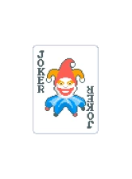
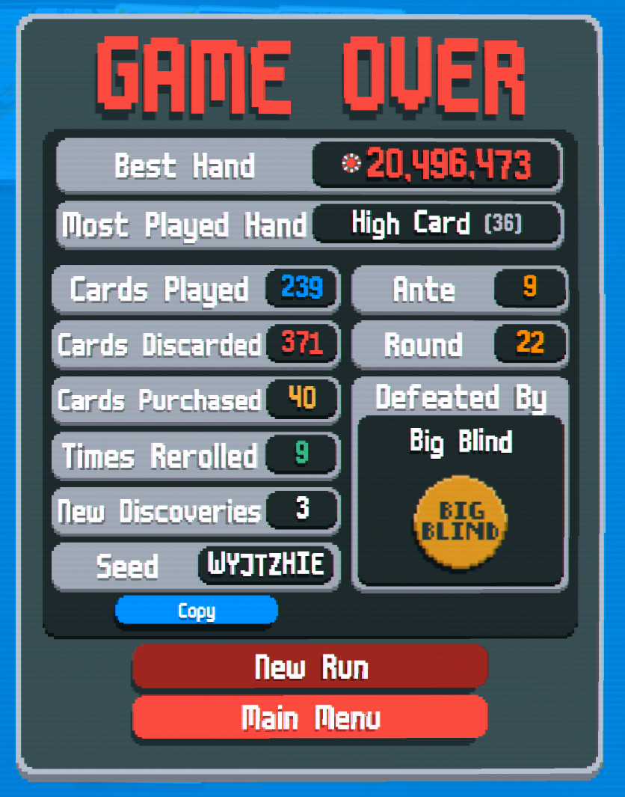

# Combos

[TOC]

## 2's and Multipliers

**Jokers**

| Vagabond | Hanging Chad | Wee Joker | Midas Mask | Vampire | Campfire | Acrobat (Negative) |
| -------- | ------------ | --------- | ---------- | ------- | -------- | ------------------ |
|  |  |  |  |  |  |  |

 

Admittedly, this combo isn't super strong, but it was enough to win a round. This is really three separate combos built into one. 

**Combo 1: Vagabond + Campfire + Vampire**

The general idea is that you want to go into each bind at or under $4 so that every hand you play generates a terot card that you can use to sell (to increase Campfire multiplier) or to enhance cards (to increase Vampire multiplier)

**Combo 2: Hanging Chad + Wee Joker**

Playing hands with as many 2's as possible will constantly increase Wee Joker and Hanging chad will retrigger your first scoring 2 an additional two times, increasing Wee Joker a total of three times for the first scoring 2. 

**Combo 3: Midas Mask + Campire**

Any scored face card is made into a gold card and then Vampire immediately removest he enchangement and gets an increase. If you wait until using 5 face cards to score on the last hand, it results at least a 0.5x increase to Vampire each round. 

---

PS. Acrobat was only included in the run because it was negative. I also had a base count of 6 jokers due to using the Black Deck. 

**Result**

{: style="height:400px;width:300px"}

## Retriggered 10s

**Jokers**

| Lusty Joker (Negative) | Raised Fist | Hanging Chad | Walkie Talkie | Dusk (Negative) | The Trio (Negative) | Blueprint | Ancient Joker |
| ---------------------- | ------------ | ------------ | ------------- | --------------- | ------------------- | --------- | ------------- |
|  |  |  |  |  |  |  |  |

Key items here are Blueprint + Ancient Joker + The Trio + Hanging Chad + Dusk . The general idea is that you want to use Blueprint to copy whichever of Ancient Joker or The Trio that will give you a higher multiplier. Unless your hand doesnt include the suit offered by Ancient Joker at all, it should offer the highest multiplier. You want to run your most powerful hand as the very last hand of the game to trigger Dusk. In my particular run, I was using walkie talkie to build up a higher multiplier for each 10. You could easily replace it with other jokers to trigger based on other cards, like aces, face cards, etc. 

**Result**

{: style="height:400px;width:300px"}