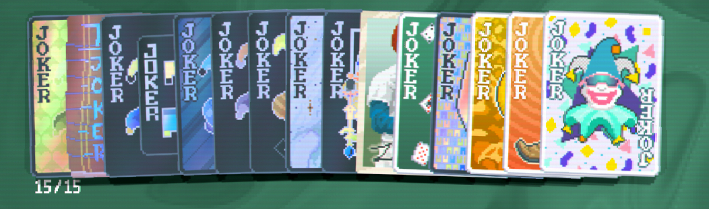

# Seeds

[TOC]

## Negative Jokers For Days

**SEED**: `MXJ88W3D`

**Deck**: Anaglyph Deck

**Steps**: 

Crucial Steps: 

1. Skip Big Bind on Anti 1 (Colelcting `Rare Joker`), this will result in getting `Baseball Card`.

1. Skip any bind offering `Double Tag` but play the rest.

1. Finally, Skip Small Bind Anti 5 to collect `Negative Tag` and get 6 additional copies.

1. Skip Small Bind Anti 6 to Collect another `Double Tag`.

1. Skip Big Bind Anti 6 to collect another `Negative Tag`, giving you 3 more negative jokers

Feel free to play around with rerolling or holding on to the tags for later rounds to see what jokers you can get. From the few runs I have done, you get the most `Uncommon` negative jokers if you just reroll several times after Big Bind Anti 5 when you can finally collect the negative jokers.

